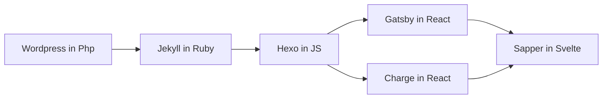

## **关于本站**

If you are reading this page on Github, click here for [English](https://github.com/qutang/qutang.dev/blob/master/README.md) version.

本静态网站托管我的项目，帖子和联系信息。 它用[sapper](https://sapper.svelte.dev) + [svelte](https://svelte.dev) + [netlify](https://netlify.com)技术栈搭建。

本网站支持，

1. 中英文切换。
2. Netlify内容管理系统。
3. Netlify身份管理系统。
4. 分页。
5. Mailchimp订阅。
6. 博文分类页。
7. 网站地图和RSS订阅。
8. Markdown文件和Jupyter笔记本的导入。

**免责声明：该网站是在很短时间内（不到三天）开发的。代码的组织结构可能不够好，请谨慎使用。**

### 合作

1. 你可以随意fork本仓库并在此基础上创建自己的网站。
2. 请注意，本站所有文字，图片和视频内容是由[Attribution-NonCommercial-ShareAlike 4.0 International](https://creativecommons.org/licenses/by-nc-sa/4.0/)许可证共享和保护的。
3. 如果想在本站上共同撰写文章或者贡献内容，请通过本站上的[联系信息](https://qutang.dev/about#contact)联系我。
4. 如果你想加入以完善本站，请在仓库创建issues或向我发送pull requests。

### 未来方向

到目前为止，我对SSN（sapper + svelte + netlify）这个技术栈感到满意，因此预计我将使用相当长一段时间。我的主要工作在Python中完成，因此请JS的水平一般，请见谅。

分享一个小故事，关于我建立个人网站的技术轨迹，

感谢Rich Harris，我认为Sapper的存在极大方便了快速建立具有高度灵活性的个人网站。
